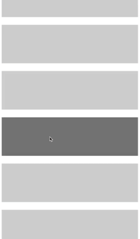

# React Native Radial Context Menu

An easy to use context menu component for React Native, inspired by [The Guardian's radial context menu](https://github.com/guardian/android-radialactionmenu) in their Android app.



## Installation 

```bash
npm i --save react-native-radial-context-menu
```

## Usage 

```js
import { withRadialActionMenu } from 'react-native-radial-context-menu'

// Wrap any component with the provided Higher Order Component.
const ListItemWithMenu = withRadialActionMenu(() => <View />)

// Instantiate the wrapped component, passing in the buttons as props.
const App = () => (
    <ListItemWithMenu
      buttons={[
        { component: () => <Text>1</Text>, value: 1 },
        { component: () => <Text>2</Text>, value: 2 },
        { component: () => <Text>3</Text>, value: 3 },
        { component: () => <Text>4</Text>, value: 4 },
      ]}
    />
)
```

### Props

| Prop              | Type       | Required | Default   | Description                                                                                     |
| ----------------- | ---------- | -------- | --------- | ----------------------------------------------------------------------------------------------- |
| `backgroundColor` | _String_   | Optional | `#fa8072` | Background color for both the menu and buttons.                                                 |
| `buttons`         | _Array_    | Required | `[]`      | Array of button objects. Each button requires a `component` and `value`.                        |
| `buttonDiameter`  | _Number_   | Optional | `60`      | Width of each button.                                                                           |
| `menuDiameter`    | _Number_   | Optional | `90`      | Width of the menu at the touch origin.                                                          |
| `onClose`         | _Function_ | Optional | `void`    | Callback fired when the menu is closed, with either the `value` of the chosen button or `null`. |
| `onOpen`          | _Function_ | Optional | `void`    | Callback fired when the menu is opened.                                                         |
| `openDelay`       | _Number_   | Optional | `0`       | Number of milliseconds on press in before the menu opens.                                       |
| `spreadAngle`     | _Number_   | Optional | `170`     | Angle between the first and last button from the touch origin.                                  |
| `spreadRadius`    | _Number_   | Optional | `100`     | Distance the buttons move out from the touch origin.                                            |
| `vibrate`         | _Boolean_  | Optional | `true`    | Vibrate on move over a button.                                                                  |
| `vibrateDuration` | _Number_   | Optional | `50`      | Number of milliseconds of the vibration.                                                        |

### Contribute

We warmly welcome any contributions! You can open a Pull Request [here](https://github.com/thegreatercurve/react-native-radial-context-menu/pulls).